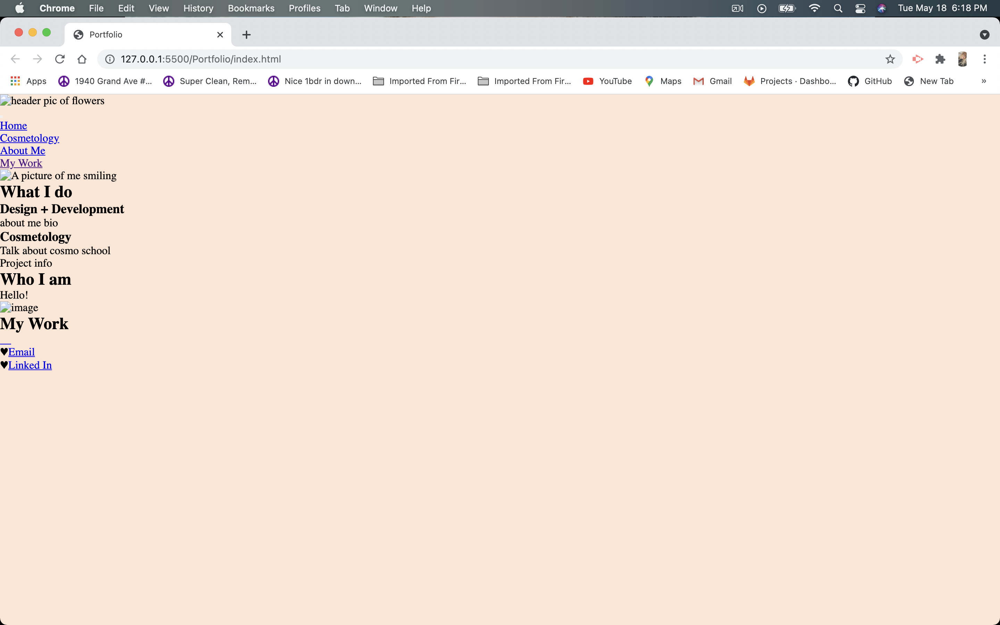
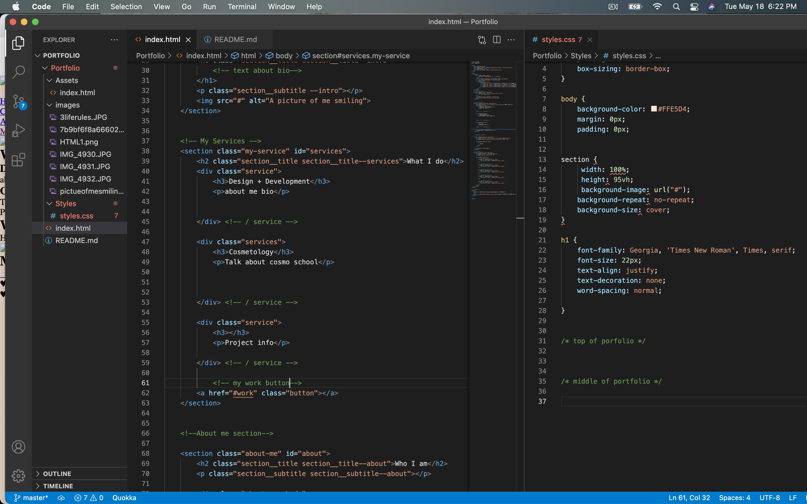
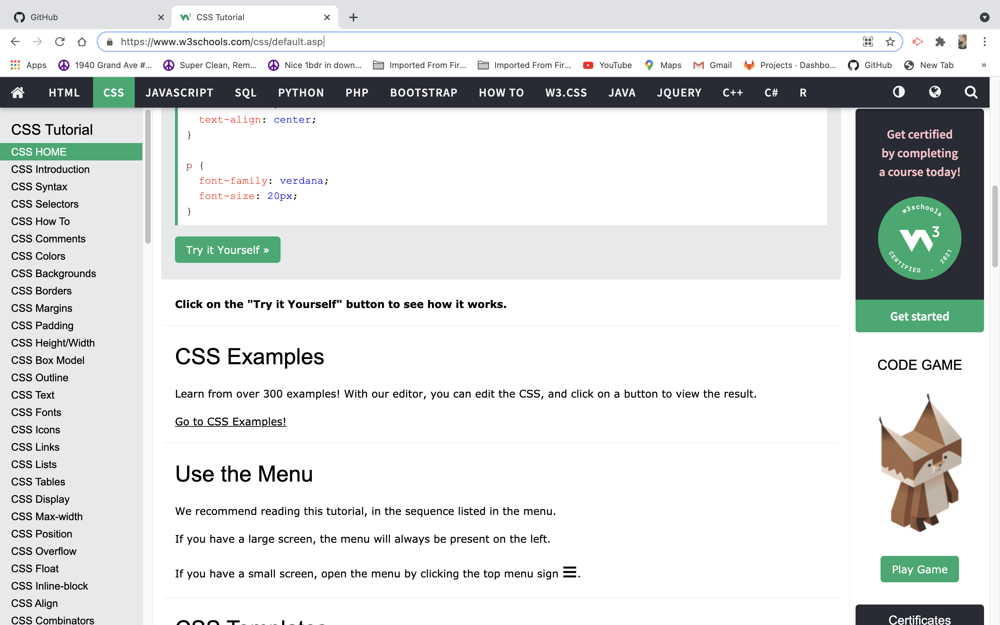

# Portfolio

Kiessa Legacie 6:00PM
# Challenge 2- Interactive Portfolio
> Interactive Portfolio
---
### Table of Contents
- [Description](#description)
- [Introduction](#introduction)
- [Challenges](#challenges)
- [Victories](#victories)
- [Resources](#resources)

---

## Description

Challenge #2- Interactive Portfolio 

## Introduction 
This challenge gave me the oppourtunity to creat and deploy my first interactive professional portfolio.  

--
Kiessa Legacie 6:34PM

## Challenges
I struggled with my style sheet quite a bit, the more I work on HTML and CSS the more confident I become in writing it. 

## Victories
Victories have happened each time my code works. I really enjoyed using different color pallets and customizing the style of my portfolio.

---

The img above is a screenshot showing my basic portfolio with little style.

---

The design aspect is proabably my favorite part of the process. I found another really cool resource for adding icons! I decided to utilize that also! 

## Resources 

<a href="https://klegacie1009.github.io/Portfolio/">GitHub Repo</a>

<a href="https://www.youtube.com/results?search_query=css+stylesheet+tutorial">YouTube</a>

<a href="https://www.w3schools.com/css/css_intro.asp">w3 Schools</a>

<a href="https://www.google.com/">Google</a>

<a href="https://coolors.co/">Coolors</a>
